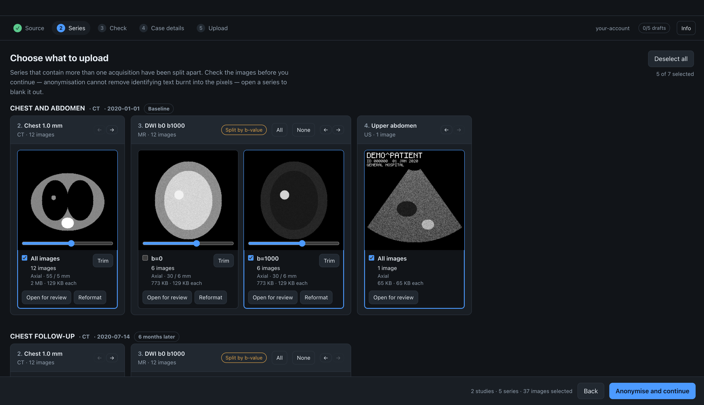

<div align="center">


# Radiouploader

[](LICENSE)
[](https://gmadevs.github.io/Radiouploader/develop/packaging)
[](https://gmadevs.github.io/Radiouploader/limitations)
[](https://gmadevs.github.io/Radiouploader/)
[](https://github.com/gmadevs/Radiouploader/actions/workflows/build.yml)
[](https://github.com/gmadevs/Radiouploader/actions/workflows/test.yml)
[](https://github.com/gmadevs/Radiouploader/security/code-scanning)
[](https://github.com/gmadevs/Radiouploader/actions/workflows/gitguardian.yml)
[](https://www.codefactor.io/repository/github/gmadevs/radiouploader)
[](https://coderabbit.ai)
[](https://snyk.io/test/github/gmadevs/Radiouploader)
[](https://www.electronjs.org/)
[](https://www.typescriptlang.org/)
[](https://react.dev/)

</div>

A desktop app for preparing and uploading cases to [Radiopaedia.org](https://radiopaedia.org).

Point it at a folder, a zip or a handful of DICOM files. It reads the study, splits the
series that contain more than one acquisition — multiphase, diffusion, SWI — lets you pick
what to keep, blank out any text burnt into the pixels, crop away the margins and set the
contrast, anonymises
everything with Radiopaedia's reference anonymiser, and uploads the result as a draft case.

Before it anonymises it looks through the images for burnt-in banners and rings what it
finds. It finds the obvious ones, and it never reports a selection as clean.

Runs on macOS, Linux and Windows.

> Unofficial. Not affiliated with or endorsed by Radiopaedia.org.

## Download

<!-- downloads: npm run links -->

Version **1.0.0**. Nothing is signed, so the first launch needs one extra step per
platform: [how to open it](https://gmadevs.github.io/Radiouploader/guide/install).

| | Also built |
|---|---|
| [](https://github.com/gmadevs/Radiouploader/releases/download/v1.0.0/Radiouploader-1.0.0-arm64.dmg) | Intel: [.dmg](https://github.com/gmadevs/Radiouploader/releases/download/v1.0.0/Radiouploader-1.0.0.dmg) |
| [](https://github.com/gmadevs/Radiouploader/releases/download/v1.0.0/Radiouploader-1.0.0.AppImage) | AppImage arm64: [.AppImage](https://github.com/gmadevs/Radiouploader/releases/download/v1.0.0/Radiouploader-1.0.0-arm64.AppImage) · Debian amd64: [.deb](https://github.com/gmadevs/Radiouploader/releases/download/v1.0.0/radiouploader_1.0.0_amd64.deb) · Debian arm64: [.deb](https://github.com/gmadevs/Radiouploader/releases/download/v1.0.0/radiouploader_1.0.0_arm64.deb) |
| [](https://github.com/gmadevs/Radiouploader/releases/download/v1.0.0/Radiouploader.Setup.1.0.0.exe) |  |

On macOS, with Homebrew — the second line because the app is not signed and
Homebrew quarantines what it downloads:

```bash
brew install --cask gmadevs/radiouploader/radiouploader
xattr -dr com.apple.quarantine /Applications/Radiouploader.app
```

Older versions, and the notes that come with each, are on the [releases page](https://github.com/gmadevs/Radiouploader/releases).

<!-- /downloads -->



## Documentation

**[gmadevs.github.io/Radiouploader](https://gmadevs.github.io/Radiouploader/)**

| | |
|---|---|
| [Install and sign in](https://gmadevs.github.io/Radiouploader/guide/install) | registering an OAuth application, first launch on each platform |
| [Using it](https://gmadevs.github.io/Radiouploader/guide/import) | the whole wizard, screen by screen |
| [How it works](https://gmadevs.github.io/Radiouploader/internals/architecture) | the pipeline, the process split, why the order is what it is |
| [Known limitations](https://gmadevs.github.io/Radiouploader/limitations) | what it does not do yet, and why |

## Development

```bash
npm install
npm run dev        # hot-reloading Electron
npm test           # unit tests plus anonymiser and decoder integration tests
npm run smoke      # boots the built app, fails on console errors
npm run shots      # regenerates the documentation screenshots
npm run docs:dev   # the documentation site, locally
```

More in [build and run](https://gmadevs.github.io/Radiouploader/develop/build).

## Security

Found a way this app could leak patient data, or a hole in how it keeps credentials? Report
it privately — [SECURITY.md](SECURITY.md) says how, and what not to attach to a report.

## Licence

AGPL-3.0-only.

This app links [radiopaedia/dicom-anonymiser](https://github.com/radiopaedia/dicom-anonymiser),
which is AGPL-3.0-only, so the combined work is too. If you distribute a build, publish the
source.

Using their reference anonymiser is not just convenient: Radiopaedia re-runs it on every
uploaded DICOM and rejects the file if any tag would change, and API clients found to have
uploaded patient data are suspended. The output satisfies that validator —
`PatientIdentityRemoved` is set to `YES`, `SOPInstanceUID` is removed entirely, and the
UIDs are rewritten into the required `1.2.826.0.1.3680043.10.341.512.…` hashed scheme.

The DICOM fixtures under `src/main/anon/__fixtures__/` come from that same repository. The
sample study the screenshots are taken on is generated, not real — see
[screenshots](https://gmadevs.github.io/Radiouploader/develop/screenshots).
