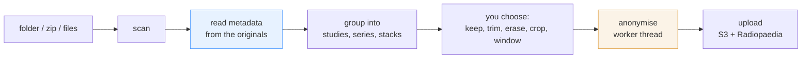

# Architecture

Radiouploader is an Electron app. Most of its design follows from one rule: patient data is
handled only in the main process.

## The pipeline



The steps must run in this order. Radiopaedia's anonymiser keeps only the elements on its
whitelist and removes all private tags. The information the app needs to group images, such
as b-values and study dates, is only in the original files, so the app reads and groups them
first and anonymises last. See [splitting before anonymisation](/internals/splitting).

## The code

```
src/main/ingest/    scan folders and zips, read metadata, group into stacks
src/main/codecs/    decode compressed pixel data and video; encode video frames as JPEG
src/main/anon/      the anonymiser, in a worker thread
src/main/volume/    build volumes and reformats
src/main/api/       OAuth, case and study creation, S3 upload
src/preload/        the IPC bridge between the renderer and the main process
src/shared/         types, the DICOM reader, geometry, Radiopaedia's lists
src/renderer/       the user interface
```

The renderer runs sandboxed and has no Node access. It reads files only through the IPC
bridge, which serves only files that belong to the current import, and sends decoded frames
at preview size, not whole files.

Whole files do not cross the bridge because a cine run is often 250 MB, and sending one costs
three copies: the file read, the `ArrayBuffer` slice and the structured clone. This used to
fail with `RangeError: Failed to allocate memory`.

## Decoding

Uncompressed pixel data is read by `src/shared/dicomImage.ts`, in two parts: the header, from
the first few kilobytes of the file, and each frame, from its own byte range. No whole file is
held in memory.

Compressed pixel data is decoded by `src/main/codecs/decode.ts`. JPEG, JPEG-LS, JPEG 2000 and
HTJ2K use the standalone `@cornerstonejs/codec-*` WASM builds, loaded on first use. Lossless
JPEG and RLE are decoded in JavaScript. A compressed frame cannot be located by calculation,
so the app reads the fragment table to find where each frame starts, and it keeps the last
parsed file so that scrolling through a cine does not parse it again for every frame.

The app does not use `@cornerstonejs/dicom-image-loader`. It depends on `@cornerstonejs/core`,
whose circular class dependencies throw `Class extends value undefined` once bundled, and the
app does not need it, because it draws pixels on a plain canvas. The codecs are CommonJS
Emscripten modules that find their `.wasm` file through `__filename`, so they are kept outside
the bundle and unpacked from the asar. The decode-only builds are shipped, plus the full
libjpeg-turbo build, whose encoder compresses video frames.

A decoder can return data in a different form from what the file header describes, for
example RGB where the header says YCbCr, or 16-bit samples for 12-bit data. The app therefore
takes the geometry from the decoder output, not from the header.

### Video

Video (MPEG-2, H.264, HEVC) is stored as one stream in a container, not as one fragment per
frame: MPEG-TS or MP4 for H.264 and HEVC, and an elementary, program or transport stream for
MPEG-2. Most frames are stored as differences from earlier frames, so they cannot be decoded
one at a time.

`src/main/codecs/video.ts` passes the whole stream to ffmpeg, which runs as a child process of
the main process, and writes the frames to disk as RGB. After that, a video frame is a byte
range, like a frame of an uncompressed cine. `src/main/videoCache.ts` decodes each video once
per session, in the session's working folder, when the preview, the burnt-in text check or the
anonymiser first needs it. ffmpeg outputs PPM, which states the size of each frame, so a video
whose frames do not match the size in the DICOM header is refused with an error.

At anonymisation, each frame is erased and cropped as needed and then compressed as JPEG by
`src/main/codecs/encode.ts`.

The app does not use Chromium's video decoders, although Electron includes them, because they
run in a renderer process, and a decoded clip is hundreds of megabytes of patient images that
would have to cross the IPC bridge.

## Where data is stored

| Data | Location |
|---|---|
| Original files from a zip, anonymised files, decoded video | a temporary session folder, deleted on reset and on quit, or at the next launch after a crash |
| OAuth tokens | the system keychain, through Electron `safeStorage` |
| Application ID and secret | `config.json` in the app's user data folder, with the secret encrypted |
| Patient data | never in the repository or in logs |

## Network requests

The app connects to Radiopaedia to sign in, to read the account and its draft cases, and to
upload. The upload sends files directly to Amazon S3 through URLs signed by Radiopaedia. At
launch, unless you turn it off, the app asks GitHub for the latest release number. It makes
no other requests.
