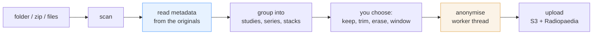

# Architecture

An Electron app with three processes' worth of separation and one rule that decides most of
the design: **patient data lives only in the main process**.

## The pipeline



The order is not negotiable. Radiopaedia's anonymiser applies a whitelist: every element is
stripped unless explicitly permitted, and all private tags go. The information the app needs
to group images sensibly exists **only in the originals**, so reading and grouping happen
first and anonymisation happens last. [The long version](/internals/splitting).

## The process split

```
src/main/ingest/    scan folders and zips, read metadata, group into stacks
src/main/anon/      the anonymiser, in a worker thread
src/main/api/       OAuth, case and study creation, S3 upload
src/shared/         types, the DICOM decoder, Radiopaedia's taxonomy
src/renderer/       the wizard UI
```

The renderer has **no Node access**. It reaches the filesystem solely through the IPC
bridge, which serves only files belonging to the current import — and serves *decoded,
preview-sized frames* rather than files.

That last part is not an abstraction for its own sake. A cine run is routinely 250 MB, and
moving one across the bridge costs three copies of it: the read, the `ArrayBuffer` slice and
the structured clone. Doing it that way is how this used to fail with
`RangeError: Failed to allocate memory`. Now only the finished pixels of one frame cross.

## The decoder

Previews are decoded by a small purpose-built reader in `src/shared/dicomImage.ts`, split
into a header parse and a per-frame decode. Nothing ever holds a whole file: the header
comes from the first few kilobytes, and each frame is read from just its own byte range.

It deliberately does **not** use `@cornerstonejs/dicom-image-loader`, which drags in
`@cornerstonejs/core`, whose viewport and rendering-engine class hierarchy is circular
enough to throw `Class extends value undefined` once bundled — and none of it is needed,
since the pixels are painted onto a plain canvas.

The cost of that choice is that compressed transfer syntaxes are reported rather than
rendered. See [known limitations](/limitations).

## Where data lives

| | |
|---|---|
| Originals and anonymised output | a session temp directory, removed on reset and on quit |
| OAuth tokens | the OS keychain, via Electron `safeStorage` |
| Application ID and secret | `config.json` in the app's user-data directory, secrets encrypted |
| Anything at all | never in the repository, never in a log |

The only outbound request in the whole app is the upload.
