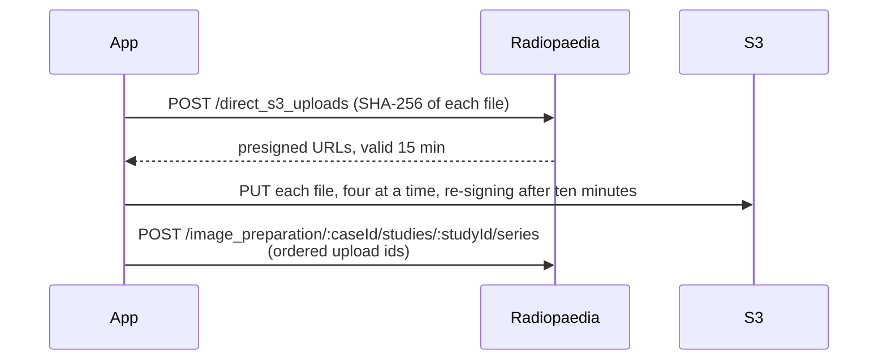

# Why upload goes through S3

Radiopaedia's API has an endpoint that accepts a zip file,
`POST /api/v1/cases/:id/studies/:id/images`, but the app does not use it.

With a zip, Radiopaedia rebuilds the series from the DICOM UIDs in the files. Anonymisation
replaces UIDs with hashed values, and the same original UID always gives the same new UID, so
all stacks split from one series still share its `SeriesInstanceUID`. Uploaded as a zip, they
would be merged back into one series, and the [splitting](/internals/splitting) would be lost.

The app therefore uses the upload route in which it states which files form each series:

The first and last calls are at the root of the site, not under `/api/v1/`.

A presigned URL is valid for 15 minutes, and S3 checks it when a PUT starts. On a slow
connection a large series can take longer than that, for example a cine that is about 1 GB
after decoding. The app therefore requests new URLs for the files not yet started once the
URLs are ten minutes old. If S3 answers a PUT with `403`, the app requests a new URL for that
file once; a second `403` is treated as an error.

## When something fails

Requesting URLs and uploading a file to S3 can safely be repeated. Both are retried up to four
times, with increasing delays, when the connection drops, the server returns an error, or the
request is rate-limited. Other errors, such as `400`, are not retried.

Creating the case, creating a study and attaching a series cannot safely be repeated: if a
request reached the server but the response was lost, repeating it would create a duplicate.
These calls are never retried. Instead, the app records each one after it succeeds. If an
upload stops partway, clicking **Upload to Radiopaedia** again continues in the same case: it
reuses the studies already created, skips the series already attached, and sends the
interrupted series again. Files that already reached S3 are reported as already uploaded and
are not sent again.

The record is kept in `config.json` in the app's user data folder, so an upload can also be
continued after the app has been closed. It contains the case id, a one-way hash of each
study's `StudyInstanceUID` (never the UID itself), and for each stack a hash of its
anonymised files, both for the stacks already attached and for all the stacks the upload
planned to send. Because the anonymiser is deterministic, importing and anonymising the same
study with the same choices produces the same hashes.

A later upload continues the recorded one only if it goes into the recorded draft (the case
step selects it), contains at least one of the planned stacks, and contains every stack
already attached, unchanged. A stack changed since, for example with an extra erased area,
has a different hash, so it is not treated as already uploaded. The record is cleared when
the upload finishes, when its case is no longer a draft, or when you choose
**Start a new case instead**. See `src/main/interruptedUpload.ts`.

## Series order

The series endpoint takes `image_format`, `series.root_index` and the ordered list of upload
ids. It has no position parameter, and the API cannot reorder the series of a case afterwards,
so series appear in the order they are posted. This is why the picker lets you
[reorder series](/guide/choose#changing-the-order-of-series) before upload.

`root_index` does not affect the order. It is the 0-based index of the frame shown as the
series thumbnail. The app uses the middle image, or 0 for a single image.

## Cases are not marked as finished

The API has one more call, `PUT /api/v1/cases/:id/mark_upload_finished`, which the app does
not make. The API reference describes it as: *"To prevent conflicts between edits via API and
via the main site, cases cannot be edited on the site until they are marked 'upload
finished'."*

The app does not call it for two reasons. Every case uploaded with the app has to be edited
on Radiopaedia afterwards, because plane and sequence type cannot be set through the API,
and this editing has worked on every case without the call. And a case that is not marked
stays a draft, which is needed to [add images to it later](/guide/upload#where-the-images-go).
The documentation does not say clearly whether marking a case does more than allow editing,
and publishing a case by mistake cannot be undone.
