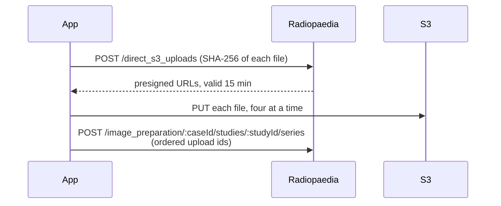

# Why upload goes through S3

`POST /api/v1/cases/:id/studies/:id/images` accepts a zip, and it looks like the obvious
route. It is the wrong one for this app.

Radiopaedia rebuilds the series from the DICOM identifiers in that zip. Anonymisation
regenerates UIDs deterministically, so every stack cut out of one original series still
shares its `SeriesInstanceUID` — the zip route would merge the stacks back together and
undo the entire point of [splitting them](/internals/splitting).

So the app uses the route that states series membership explicitly:

Steps 1 and 3 live at the **site root**, not under `/api/v1/`.

Because the presigned URLs expire after 15 minutes, a very large case is uploaded in
batches rather than requesting every URL up front.

## Series order is post order

The series endpoint takes `image_format`, `series.root_index` and the list of upload ids.
There is no position in it, and no endpoint to reorder a case afterwards — so the order the
series appear in is the order they were posted in, one at a time, and that is the only lever
there is. It is why the picker lets a series be
[moved past its neighbour](/guide/choose): the order left there is the order that ships.

`root_index` is not that lever. It is 0-based and picks which frame of the series is shown
as its thumbnail; the middle one is the useful default, and for a single image it has to
be 0.

## The step this app does not take

There is a fourth call in the API — `PUT /api/v1/cases/:id/mark_upload_finished` — and this
app has never made it. The reference explains it as *"To prevent conflicts between edits via
API and via the main site, cases cannot be edited on the site until they are marked 'upload
finished'."*

It is left alone on purpose, for two reasons.

Every case this app uploads **has** to be edited on Radiopaedia afterwards, because plane
and sequence type have no API parameter at all and are tagged on the site. That editing has
worked on every case, unmarked, so whatever the flag guards, it is not stopping the one
thing this app depends on.

And a case that is never marked stays a **draft**, which is what
[adding images to it later](/guide/upload) requires. Marking it might do more than unlock
editing — that is not documented clearly enough to risk on a real case — and publishing one
by accident cannot be undone.
